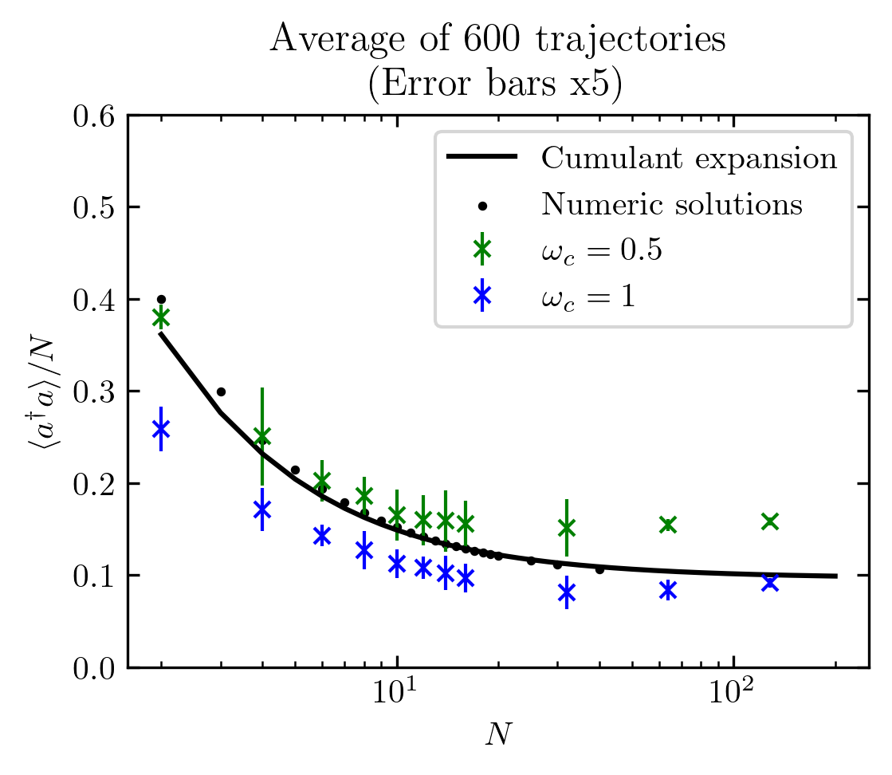
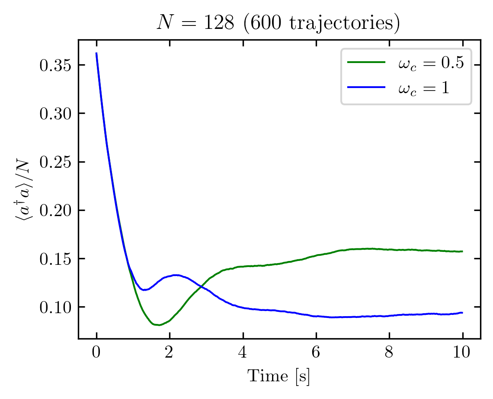
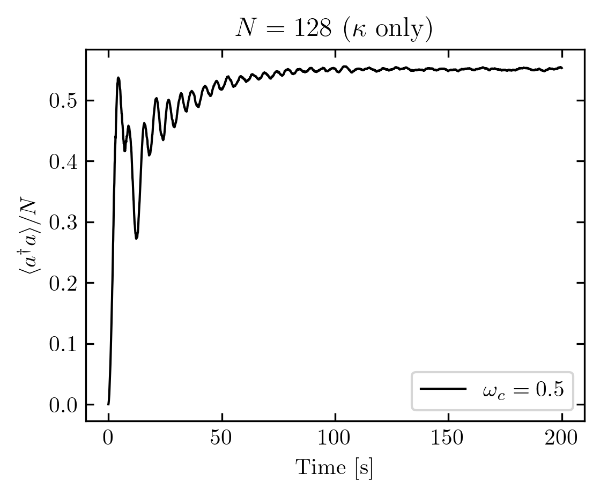

## Quantum Trajectories for Permutation Symmetric Dicke Model

Starter code for quantum trajectories for a spin-1/2 cavity to reproduce Fig 2a of [Kirton](https://doi.org/10.1103/PhysRevLett.118.123602), using purely collective jumps formulated using the results of [Barberena](https://doi.org/10.48550/arXiv.2508.05751).

**Current Results:**

